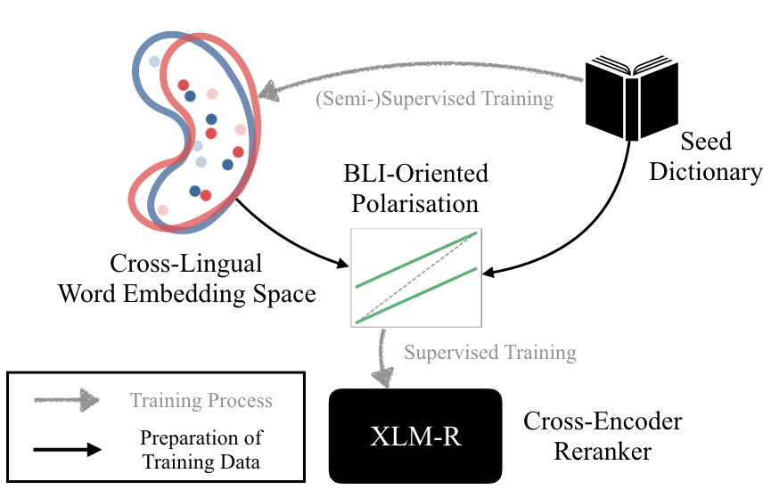

# Improving Bilingual Lexicon Induction with Cross-Encoder Reranking

This repository is the official PyTorch implementation of the following paper: 

Yaoyiran Li, Fangyu Liu, Ivan Vulić, and Anna Korhonen. 2022. *Improving Bilingual Lexicon Induction with Cross-Encoder Reranking*. In Findings of EMNLP 2022. 

<p align="center">
  
</p>

**BLICEr** is a post-hoc reranking method that works in the synergy with any given Cross-lingual Word Embedding (CLWE) space to improve Bilingual Lexicon Induction (BLI) / Word Translation. **BLICEr** is applicable to any existing CLWE induction method such as [ContrastiveBLI](https://github.com/cambridgeltl/ContrastiveBLI/), [RCSLS](https://github.com/facebookresearch/fastText/tree/main/alignment), and [VecMap](https://github.com/artetxem/vecmap), leverages [Cross Encoders](https://www.sbert.net/examples/applications/cross-encoder/README.html)

## Dependencies:

- PyTorch >= 1.10.1
- Transformers >= 4.15.0
- Python >= 3.9.7
- Sentence-Transformers >= 2.1.0

## Get Data and Set Input/Output Directories:
Following [ContrastiveBLI](https://github.com/cambridgeltl/ContrastiveBLI/), our data are obtained from the [XLING repo](https://github.com/codogogo/xling-eval) and [PanLex-BLI](https://github.com/cambridgeltl/panlex-bli); please refer to [ContrastiveBLI](https://github.com/cambridgeltl/ContrastiveBLI/) for data preprocessing details.

Our BLICEr is compatible with any CLWE backbones, and our demo here is based on the state-of-the-art [ContrastiveBLI](https://github.com/cambridgeltl/ContrastiveBLI/) 300-dim C1 CLWEs, which is derived with purely static fastText embeddings (ContrastiveBLI also provides much stronger 768-dim C2 CLWEs which are trained with both fastText and mBERT). Please modify the input/output directories accordingly when using different CLWEs.  

## Run the Code:

```bash
python run_all.py
```
## Citation:
Please cite our paper if you find **BLICEr** useful. If you like our work, please ⭐ this repo.
```bibtex
@inproceedings{li-etal-2022-bilingual,
    title     = {Improving Bilingual Lexicon Induction with Cross-Encoder Reranking},
    author    = {Li, Yaoyiran and Liu, Fangyu and Vulić, Ivan and Korhonen, Anna},
    booktitle = {In Findings of the Association for Computational Linguistics: EMNLP 2022},    
    year      = {2022}
}
```
